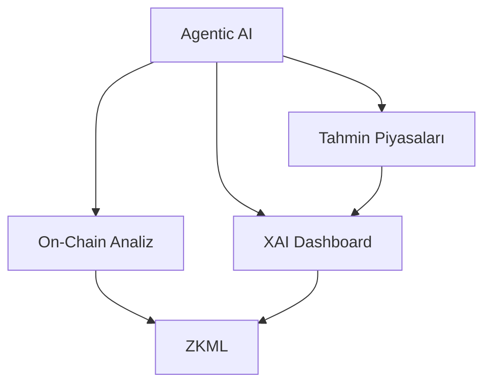

# Merf.ai v3.5 Stratejik Teknoloji Yol Haritası
## Otonom Finansal Zeka Platformu

---

## 📋 Yönetici Özeti

Merf.ai v3.5, beş kritik teknolojik sütun üzerine inşa edilecek:

| Sütun | Teknoloji | Öncelik | Süre |
|-------|-----------|---------|------|
| 1 | **Agentic AI** | Yüksek | 6-8 hafta |
| 2 | **On-Chain Analiz** | Yüksek | 5-6 hafta |
| 3 | **Tahmin Piyasaları** | Orta | 4-5 hafta |
| 4 | **XAI Dashboard** | Orta | 3-4 hafta |
| 5 | **ZKML** | Düşük (PoC) | 6-8 hafta |

**Toplam Tahmini Süre**: 16-20 hafta (3 aşamada)

---

## 🏗️ Aşama 1: Temel Altyapı (8-10 Hafta)

### 1.1 Agentic AI - Otonom Finansal Ajanlar

#### Mimari
```
server/
├── agents/
│   ├── orchestrator.ts      # LangGraph ana orkestratör
│   ├── financial-agent.ts   # Finansal analiz ajanı
│   ├── research-agent.ts    # Araştırma ajanı
│   ├── trading-agent.ts     # Ticaret sinyali ajanı
│   └── tools/
│       ├── backtest-tool.ts
│       ├── sam-tool.ts
│       ├── market-tool.ts
│       └── news-tool.ts
```

#### Veritabanı Şeması
```sql
-- Agent çalışma kayıtları
CREATE TABLE agent_runs (
  id SERIAL PRIMARY KEY,
  agent_type VARCHAR(50) NOT NULL,
  user_id INTEGER,
  status VARCHAR(20) DEFAULT 'pending',
  input JSONB,
  output JSONB,
  error TEXT,
  started_at TIMESTAMP DEFAULT NOW(),
  completed_at TIMESTAMP,
  tokens_used INTEGER DEFAULT 0,
  cost_usd DECIMAL(10,4)
);

-- Agent görevleri
CREATE TABLE agent_tasks (
  id SERIAL PRIMARY KEY,
  run_id INTEGER REFERENCES agent_runs(id),
  task_type VARCHAR(50),
  tool_name VARCHAR(100),
  input JSONB,
  output JSONB,
  status VARCHAR(20),
  execution_time_ms INTEGER,
  created_at TIMESTAMP DEFAULT NOW()
);

-- Tool gözlemleri
CREATE TABLE tool_observations (
  id SERIAL PRIMARY KEY,
  task_id INTEGER REFERENCES agent_tasks(id),
  observation_type VARCHAR(50),
  data JSONB,
  confidence DECIMAL(3,2),
  created_at TIMESTAMP DEFAULT NOW()
);
```

#### Gerekli Paketler
```json
{
  "@langchain/core": "^0.3.0",
  "@langchain/langgraph": "^0.2.0",
  "@langchain/openai": "^0.3.0",
  "zod": "^3.22.0"
}
```

#### Agent Yetenekleri
1. **Finansal Analiz Ajanı**
   - Backtest servisi ile tarihsel analiz
   - SAM metrikleri ile sentiment analizi
   - FRED ekonomik gösterge yorumlama

2. **Araştırma Ajanı**
   - Haber analizi ve özetleme
   - Şirket araştırması
   - Sektör trend analizi

3. **Ticaret Sinyali Ajanı**
   - Teknik analiz yorumlama
   - Risk/ödül hesaplama
   - Pozisyon önerileri

#### Riskler ve Çözümler
| Risk | Çözüm |
|------|-------|
| LLM maliyeti | Token limitleri, önbellekleme |
| Deterministik olmayan çıktılar | Yapılandırılmış çıktılar (Zod) |
| Uzun süreli işlemler | BullMQ queue entegrasyonu |

---

### 1.2 On-Chain Analiz - Kripto İstihbaratı

#### Mimari
```
server/
├── onchain/
│   ├── onchain-service.ts     # Ana servis
│   ├── whale-tracker.ts       # Balina takibi
│   ├── smart-money.ts         # Akıllı para analizi
│   ├── mev-detector.ts        # MEV bot tespiti
│   └── providers/
│       ├── etherscan.ts
│       ├── dune.ts
│       └── nansen.ts
```

#### Veritabanı Şeması
```sql
-- İzlenen cüzdanlar
CREATE TABLE onchain_wallets (
  id SERIAL PRIMARY KEY,
  address VARCHAR(42) NOT NULL UNIQUE,
  label VARCHAR(100),
  wallet_type VARCHAR(50), -- 'whale', 'smart_money', 'exchange', 'mev_bot'
  chain VARCHAR(20) DEFAULT 'ethereum',
  first_seen TIMESTAMP,
  last_active TIMESTAMP,
  total_volume_usd DECIMAL(20,2),
  metadata JSONB,
  created_at TIMESTAMP DEFAULT NOW()
);

-- İşlem kayıtları
CREATE TABLE onchain_transactions (
  id SERIAL PRIMARY KEY,
  tx_hash VARCHAR(66) NOT NULL,
  wallet_id INTEGER REFERENCES onchain_wallets(id),
  chain VARCHAR(20),
  block_number BIGINT,
  from_address VARCHAR(42),
  to_address VARCHAR(42),
  value_eth DECIMAL(30,18),
  value_usd DECIMAL(20,2),
  token_symbol VARCHAR(20),
  tx_type VARCHAR(50), -- 'transfer', 'swap', 'liquidity', 'nft'
  gas_used BIGINT,
  timestamp TIMESTAMP,
  metadata JSONB
);

-- Uyarılar
CREATE TABLE onchain_alerts (
  id SERIAL PRIMARY KEY,
  wallet_id INTEGER REFERENCES onchain_wallets(id),
  alert_type VARCHAR(50), -- 'large_transfer', 'unusual_activity', 'mev_detected'
  severity VARCHAR(20), -- 'low', 'medium', 'high', 'critical'
  title VARCHAR(200),
  description TEXT,
  data JSONB,
  is_read BOOLEAN DEFAULT FALSE,
  created_at TIMESTAMP DEFAULT NOW()
);
```

#### API Entegrasyonları
| API | Kullanım | Maliyet |
|-----|----------|---------|
| Etherscan | Temel tx verileri | Ücretsiz (5 req/s) |
| Dune Analytics | Özel sorgular | $349/ay (Team) |
| Nansen | Etiketli cüzdanlar | $150/ay (Starter) |
| Alchemy | Node erişimi | Ücretsiz tier |

#### Özellikler
1. **Balina Takibi**
   - $1M+ transferler anlık uyarı
   - Cüzdan etiketleme (exchange, fund, whale)
   - Hareket kalıpları analizi

2. **Smart Money Analizi**
   - Başarılı trader cüzdanları takibi
   - Copy-trade sinyalleri
   - Portfolio replikasyonu

3. **MEV Bot Tespiti**
   - Sandwich attack tespiti
   - Front-running uyarıları
   - Gas analizi

---

## 🏗️ Aşama 2: Gelişmiş Özellikler (6-8 Hafta)

### 2.1 Tahmin Piyasaları (Prediction Markets)

#### Mimari
```
server/
├── prediction/
│   ├── prediction-service.ts  # Ana servis
│   ├── market-maker.ts        # AMM lojik
│   ├── polymarket.ts          # PolyMarket API
│   └── manifold.ts            # Manifold API
```

#### Veritabanı Şeması
```sql
-- Piyasalar
CREATE TABLE prediction_markets (
  id SERIAL PRIMARY KEY,
  title VARCHAR(500) NOT NULL,
  description TEXT,
  category VARCHAR(50), -- 'crypto', 'economics', 'politics', 'sports'
  resolution_date TIMESTAMP,
  resolution_source VARCHAR(200),
  status VARCHAR(20) DEFAULT 'open', -- 'open', 'closed', 'resolved'
  outcome VARCHAR(20), -- 'yes', 'no', 'cancelled'
  liquidity_usd DECIMAL(20,2),
  volume_usd DECIMAL(20,2),
  source VARCHAR(50), -- 'internal', 'polymarket', 'manifold'
  external_id VARCHAR(100),
  metadata JSONB,
  created_at TIMESTAMP DEFAULT NOW()
);

-- Kontratlar (Yes/No pozisyonları)
CREATE TABLE prediction_contracts (
  id SERIAL PRIMARY KEY,
  market_id INTEGER REFERENCES prediction_markets(id),
  contract_type VARCHAR(10), -- 'yes', 'no'
  current_price DECIMAL(5,4), -- 0.0000 - 1.0000
  last_price DECIMAL(5,4),
  price_change_24h DECIMAL(5,4),
  total_shares DECIMAL(20,4),
  updated_at TIMESTAMP DEFAULT NOW()
);

-- Kullanıcı pozisyonları
CREATE TABLE market_positions (
  id SERIAL PRIMARY KEY,
  user_id INTEGER,
  market_id INTEGER REFERENCES prediction_markets(id),
  contract_type VARCHAR(10),
  shares DECIMAL(20,4),
  avg_price DECIMAL(5,4),
  current_value DECIMAL(20,4),
  realized_pnl DECIMAL(20,4) DEFAULT 0,
  created_at TIMESTAMP DEFAULT NOW()
);
```

#### Entegrasyon Noktaları
1. **PolyMarket API**
   - Kripto ve politik piyasalar
   - Gerçek zamanlı fiyatlar
   - Volume ve likidite verileri

2. **Manifold Markets**
   - Kullanıcı oluşturmuş piyasalar
   - Daha geniş kategori yelpazesi
   - API limitleri daha esnek

#### Özellikler
- Piyasa gösterge tablosu
- SAM sentiment ile korelasyon
- Agent tabanlı otomatik analiz
- Türkiye özel piyasaları (BIST, TCMB kararları)

---

### 2.2 XAI Dashboard - Açıklanabilir AI

#### Mimari
```
server/
├── xai/
│   ├── xai-service.ts         # Ana servis
│   ├── shap-explainer.ts      # SHAP hesaplamaları
│   ├── lime-explainer.ts      # LIME açıklamaları
│   └── narrative-generator.ts # Doğal dil açıklamalar
```

#### Veritabanı Şeması
```sql
-- Model açıklamaları
CREATE TABLE model_explanations (
  id SERIAL PRIMARY KEY,
  prediction_id INTEGER, -- İlgili tahmin
  model_name VARCHAR(100),
  model_version VARCHAR(50),
  prediction_type VARCHAR(50), -- 'market', 'sentiment', 'risk'
  prediction_value DECIMAL(10,4),
  confidence DECIMAL(3,2),
  explanation_method VARCHAR(50), -- 'shap', 'lime', 'attention'
  narrative TEXT, -- İnsan okunabilir açıklama
  created_at TIMESTAMP DEFAULT NOW()
);

-- Özellik önem skorları
CREATE TABLE feature_importances (
  id SERIAL PRIMARY KEY,
  explanation_id INTEGER REFERENCES model_explanations(id),
  feature_name VARCHAR(100),
  feature_value DECIMAL(20,6),
  importance_score DECIMAL(10,6),
  direction VARCHAR(10), -- 'positive', 'negative'
  contribution DECIMAL(10,6)
);
```

#### Özellikler
1. **SHAP Entegrasyonu**
   - Feature importance görselleştirme
   - Waterfall grafikleri
   - Özet plotlar

2. **Doğal Dil Açıklamalar**
   - "Bu tahmin şu faktörlerden dolayı yapıldı..."
   - Türkçe açıklama üretimi
   - Risk faktörleri vurgulama

3. **Karşılaştırmalı Analiz**
   - Benzer durumlarla kıyaslama
   - Tarihsel başarı oranları
   - Güven aralıkları

---

## 🏗️ Aşama 3: İleri Teknolojiler (6-8 Hafta)

### 3.1 ZKML - Zero-Knowledge Machine Learning

#### Konsept
ZKML, ML model tahminlerinin doğruluğunu kriptografik olarak kanıtlarken, model ağırlıklarını ve giriş verilerini gizli tutar.

#### Kullanım Senaryoları
1. **Doğrulanabilir Tahminler**
   - "Bu tahmin gerçekten X modelinden geldi"
   - Model manipülasyonu önleme

2. **Gizli Veri Analizi**
   - Müşteri verisi açıklanmadan analiz
   - Rekabetçi avantaj koruması

3. **On-Chain Raporlama**
   - Blokzincire kanıtlanmış tahminler yazma
   - DeFi protokolleri ile entegrasyon

#### Teknik Yaklaşım
```
zkml/
├── circuits/
│   ├── sentiment-circuit.noir  # Noir/ZK circuit
│   └── prediction-circuit.noir
├── prover/
│   └── zkml-prover.ts         # Proof üretici
└── verifier/
    └── zkml-verifier.ts       # On-chain verifier
```

#### Teknoloji Seçenekleri
| Platform | Avantaj | Dezavantaj |
|----------|---------|------------|
| Noir (Aztec) | Kolay öğrenme | Sınırlı ML desteği |
| EZKL | ML odaklı | Karmaşık kurulum |
| RiscZero | Genel amaçlı | Yüksek maliyet |

#### PoC Kapsamı
- Basit sentiment modeli için ZK kanıtı
- Proof üretim süresi ölçümü
- Gas maliyeti analizi

---

## 📊 Uygulama Takvimi

```
Hafta 1-4:   [████████████████████] Agentic AI MVP
Hafta 3-6:   [    ████████████████] On-Chain Analiz
Hafta 5-8:   [        ████████████] Tahmin Piyasaları
Hafta 7-10:  [            ████████] XAI Dashboard
Hafta 10-16: [                ████████████] ZKML PoC
```

---

## 💰 Maliyet Tahmini (Aylık)

| Servis | Maliyet | Notlar |
|--------|---------|--------|
| OpenAI API | $200-500 | Agent çağrıları |
| Dune Analytics | $349 | On-chain sorgular |
| Nansen | $150 | Cüzdan etiketleri |
| Alchemy | $0-49 | Node erişimi |
| Vercel/Hosting | $20 | Deployment |
| **Toplam** | **$719-1068/ay** | |

---

## ✅ Başarı Kriterleri

### Aşama 1
- [ ] Agent 3 farklı finansal görevi tamamlayabilmeli
- [ ] 100+ balina cüzdanı takip edilmeli
- [ ] Uyarı sistemi 1 dakika içinde bildirim göndermeli

### Aşama 2
- [ ] 50+ tahmin piyasası entegre edilmeli
- [ ] Her tahmin için XAI açıklaması üretilmeli
- [ ] SAM-Prediction Market korelasyon %60+ doğruluk

### Aşama 3
- [ ] ZKML PoC çalışır durumda
- [ ] Proof üretimi <30 saniye
- [ ] On-chain verification maliyeti <$5

---

## 🔗 Bağımlılıklar



---

## 📌 Sonraki Adımlar

1. **Hemen**: Agentic AI için LangGraph PoC başlat
2. **Bu hafta**: On-chain API'ler için hesap oluştur
3. **Gelecek hafta**: Veritabanı şema migrasyonları
4. **2 hafta sonra**: İlk agent demo

---

*Doküman Tarihi: Aralık 2024*  
*Versiyon: 1.0*
